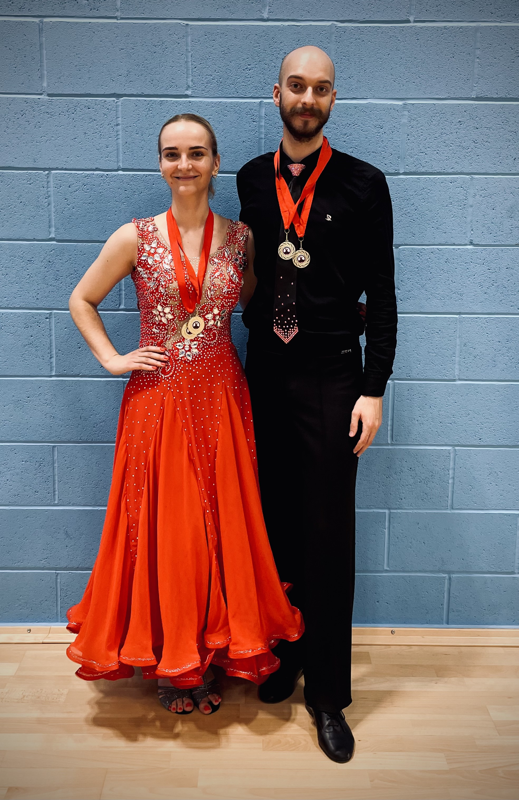

In this short post, I will introduce you to a hobby of mine by taking a quick look at the dancing competition at the University of Warwick on 20/11/21. This event was organised by fantastic **Abigail Muller** who also kindly shared some data with me. You can find the full unprocessed data [here](http://www.easycompsoftware.co.uk/results.php). 

# Competition in Numbers

Let's begin by considering the numbers of couples competing in Warwick Varsity:
```{r, message=FALSE, warning=FALSE}
knitr::opts_chunk$set(echo = TRUE)

# Load libraries
library(tidyverse)   # For data manipulation and visualisation
library(gridExtra)   # For combining multiple ggplots 
library(readxl)      # For reading excel files

# Load the data
results_numbers <- read_xlsx("/Users/adrianwisnios/Desktop/Warwick_Varsity_20_11_21_Data/Results_Numbers.xlsx")
results_unis <- read_xlsx("/Users/adrianwisnios/Desktop/Warwick_Varsity_20_11_21_Data/Results_Unis.xlsx")
entries <- read_xlsx("/Users/adrianwisnios/Desktop/Warwick_Varsity_20_11_21_Data/Entries_long.xlsx")
entries_total <- read_xlsx("/Users/adrianwisnios/Desktop/Warwick_Varsity_20_11_21_Data/Entries.xlsx")

# Used later for bars ordering
counts <- entries %>% count(University)
entries_and_counts <- entries %>% left_join(counts, by = "University")

# Common legend function
# Credits go to: 
# https://statisticsglobe.com/add-common-legend-to-combined-ggplot2-plots-in-r/
extract_legend <- function(my_ggp) {
  step1 <- ggplot_gtable(ggplot_build(my_ggp))
  step2 <- which(sapply(step1$grobs, function(x) x$name) == "guide-box")
  step3 <- step1$grobs[[step2]]
  return(step3)
}
```
```{r, fig.cap="The number of couples from each university"}
# The Competition in Numbers 
entries_total %>% 
  count(University) %>%
  ggplot(aes(reorder(University, n), n)) + geom_col(fill = "darkred") +
  coord_flip() + theme_bw() +
  theme(axis.title.y = element_blank(),
        axis.title.x = element_blank(),
        axis.ticks.x = element_blank(),
        axis.text.x = element_blank(),
        plot.background = element_rect(fill = "#e2d4d0", color = "#e2d4d0")) +
  geom_text(aes(label = n), hjust = 1.25, col = "white", size = 3)
```

In general, there were 110 couples from 13 universities. Teams representing the university of Warwick, Birmingham and Oxford together constituted almost 54% of all participants. Of course, many couples danced more than once - counting each entrance dance separately gives the following summary:

```{r, fig.cap="All dances"}
# Combine some categories for better visualisation
entries_and_counts_combined <- entries_and_counts %>%
  mutate(Cat_Combined = case_when(
    Category %in% c("Beginners_W", "Beginners_Q", 
                    "Beginners_C", "Beginners_J") ~ "Beginners",
    Category %in% c("ExStudent_CRJ", "ExStudent_Novice_CJ", 
                    "ExStudent_WQT", "ExStudent_Novice_WQT") ~ "Ex-Students",
    Category %in% c("Inter_Adv_WQT", "Intermediate_CJR") ~ "Inter/Advanced",
    Category %in% c("Open_Foxtrot", "Open_Paso", "Open_Samba",
                    "Open_V", "Rock_n_Roll", "SameSex_CJ") ~ "Open/Other",
    TRUE ~ "Novice"
    )
  )

plot_left <- entries %>%
  count(University) %>%
  ggplot(aes(x = reorder(University, + n), n)) + geom_col(fill = "darkred") +
  coord_flip() + theme_bw() + ylab("Count") +
  theme(axis.title.y = element_blank(),
        plot.background = element_rect(fill = "#e2d4d0", color = "#e2d4d0")) +
  geom_text(aes(label = n), hjust = 1.25, col = "white", size = 3)

plot_right <- ggplot(entries_and_counts_combined,
       aes(reorder(University, n), fill = Cat_Combined)) + 
  geom_bar(position = "fill") + 
  geom_text(
    aes(label = round(..count.. / tapply(..count.., ..x.., sum)[as.character(..x..)], 2)),
    stat="count",
    position = position_fill(vjust = 0.5),
    col = "black", size = 2) +
coord_flip() + theme_bw() + ylab("Proportion") +
  theme(axis.title.y = element_blank(),
        axis.text.y = element_blank(),
        legend.position = "none",
        plot.background = element_rect(fill = "#e2d4d0", color = "#e2d4d0")) +
  scale_fill_manual("Category",
                    values = RColorBrewer::brewer.pal(n = 5, name = "Reds"))

plot_legend <- ggplot(entries_and_counts_combined,
       aes(reorder(University, n), fill = Cat_Combined)) + 
  geom_bar(position = "fill") + theme(legend.position = "bottom") +
  scale_fill_manual("Category",
                    values = RColorBrewer::brewer.pal(n = 5, name = "Reds"))

shared_legend <- extract_legend(plot_legend)

grid.arrange(arrangeGrob(plot_left, plot_right, ncol = 2),
             shared_legend, nrow = 2, heights = c(10, 1))
```

where

* *Beginners* category contains:
  - English Waltz,
  - Quickstep,
  - Cha Cha Cha,
  - Jive.
* *Novice* category consists of:
  - Novice A English Waltz and Quickstep,
  - Novice B English Waltz and Quickstep,
  - Novice A Cha Cha Cha and Jive,
  - Novice B Cha Cha Cha and Jive.
* *Ex-Students* category combines:
  - Ex-Student English Waltz, Quickstep and Tango,
  - Ex-Student Cha Cha Cha, Rumba and Jive,
  - Ex-Student Novice English Waltz, Quickstep and Tango,
  - Ex-Student Novice Cha Cha Cha and Jive.
* *Inter/Advanced* category is:
  - Intermediate and Advanced English Waltz, Quickstep and Tango,
  - Intermediate and Advanced Cha Cha Cha, Rumba and Jive.
* *Open/Other* category merges:
  - Same Sex Cha Cha Cha and Jive,
  - Rock'n'Roll,
  - Open Viennese Waltz,
  - Open Foxtrot,
  - Open Paso Doble,
  - Open Sambe.

20 categories in total.

The left-hand side plot shows how many dances each university participated in. For example, if a couple from Birmingham competed in Novice A Cha/Jive, Open Paso Doble and Open Samba they count as 3 - one in *Novice* and 2 in *Open/Other*. Similarly, for remaining couples. We can see that for 6 out of 13 universities beginners category was the most popular, with Cardiff almost exclusively consisting of beginners dances. Four universities did not have any couple dancing any of the beginners' dances. 

Note, however, that the above plot does not tell us how many beginner couples each university had. To find these numbers, we need to define what we mean by a beginners couple. Is it a couple competing in four beginners dances, one or two/three of them? I think it's reasonable to consider couples that competed in any of the four dances as beginners. We will include the same-sex category to the novice this time. Using this definition, we can ask which university has the most number of each category couples. 

```{r}
couples <- entries_total %>%
  mutate(Category_Couple = case_when(
    (Beginners_W == 1 | Beginners_Q == 1 |
       Beginners_C == 1 | Beginners_J == 1) ~ "Beginner",
    (Novice_1_WQ == 1 | Novice_1_CJ == 1 |
       Novice_2_WQ == 1 | Novice_2_CJ == 1 |
       SameSex_CJ == 1) ~ "Novice",
    (ExStudent_CRJ == 1 | ExStudent_WQT == 1 |
      ExStudent_Novice_CJ == 1 | ExStudent_Novice_WQ == 1) ~ "Ex-Student",
    Inter_Adv_WQT == 1 | Intermediate_CJR == 1 ~ "Inter/Advanced",
    TRUE ~ "Else"
  )) %>%
  select(University, Category_Couple) %>%
  group_by(University) %>%
  count(Category_Couple) %>%
  filter(Category_Couple != "Else") %>%
  ungroup() 

# Beginners
b <- couples %>%
  filter(Category_Couple == "Beginner") %>%
  select(-Category_Couple) %>%
  arrange(desc(n)) %>%
  head(1)

# Novice
n <- couples %>%
  filter(Category_Couple == "Novice") %>%
  select(-Category_Couple) %>%
  arrange(desc(n)) %>%
  head(1)

# Ex-Student
e <- couples %>%
  filter(Category_Couple == "Ex-Student") %>%
  select(-Category_Couple) %>%
  arrange(desc(n)) %>%
  head(1)

# Inter/Advanced
i <- couples %>%
  filter(Category_Couple == "Inter/Advanced") %>%
  select(-Category_Couple) %>%
  arrange(desc(n)) %>%
  head(1)

table_sum <- rbind(b,n,e,i)
Category <- c("Beginners", "Novice", "Ex-Students", "Inter/Advanced")

# Which uni had the most couples for each category
knitr::kable(table_final <- cbind(Category, table_sum), 
             caption = "Universities with the most couples for each category")
```

# Medals 

Now, let me quickly investigate the most successful couples of the competition. Dancers with the number 89 won six (!) medals with two gold ones.  Also, a couple with the number 61 won three gold medals out of all four they acquired. Absolutely staggering feat!

```{r, fig.cap="Total medals"}
results_numbers_factors <- results_numbers %>%
  mutate_if(is.numeric, as.factor)

# Overall medals
freq_table <- table(unlist(results_numbers_factors[,-1]))

Number <- c("89", "115", "12, 23, 74, 61, 66")
Medals <- c("6", "5", "4")

medals_table <- cbind(Number, Medals)
knitr::kable(medals_table, caption = "Couples with the most medals")

# Gold medals
results_numbers_factors_first <- results_numbers_factors[1, ]
freq_table_first <- table(unlist(results_numbers_factors_first[,-1]))

Numbers <- c("80, 61", "74, 89, 1")
Gold_Medals <- c("3", "2")

medals_table_first <- cbind(Numbers, Gold_Medals)
knitr::kable(medals_table_first, 
             caption = "Couples holding the most gold medals")
```

If we look at overall medal-wise performance, team Warwick won 24 medals in total! Of course, the more couples and dances entered, the higher the number of won medals - we can see that Warwick, Birmingham and Oxford had the higher number of competing couples and they competed in the most number of dances, hence, they won the highest number of medals. Team Bristol dominated the scene by winning the most gold medals. Since they competed only in open and intermediate/advanced categories, their accomplishments impress even more!  

```{r}
# Universities with the most medals
results_unis_factor <- results_unis %>%
  mutate_if(is.numeric, as.factor)

freq_table_unis <- table(unlist(results_unis_factor[,-1]))
freq_table_unis <- freq_table_unis[-1]
freq_table_unis <- freq_table_unis[order(freq_table_unis)]

freq_table_unis_2 <- table(unlist(results_unis_factor[1, -1]))

df <- as.data.frame(freq_table_unis)
df2 <- as.data.frame(freq_table_unis_2)

# Final Plot
ggplot(data = df) + geom_col(aes(Var1, Freq, fill = "All")) + 
  geom_col(data = df2, aes(Var1, Freq, fill = "Gold")) +
  coord_flip() + theme_bw() + 
  theme(axis.title.y = element_blank(),
        axis.title.x = element_blank(),
        axis.ticks.x = element_blank(),
        axis.text.x = element_blank(),
        plot.background = element_rect(fill = "#e2d4d0", color = "#e2d4d0"),
        legend.background = element_rect(fill = "#e2d4d0")) +
  geom_text(data = df, aes(Var1, Freq, label = Freq), 
            hjust = 1.25, col = "black", size = 3) +
  geom_text(data = df2, aes(Var1, Freq, label = Freq), 
            hjust = 1.25, col = "black", size = 3) +
  scale_fill_manual(name = "Medals",
      values = c(All = "#FFD700", Gold = "#FF8C00"))
```

It was a fantastic event with a friendly atmosphere and many talented people! Big shout out to everybody competing, especially our incredible beginners and those who competed for the first time - you all did a fabulous job! I hope to see many of you in future competitions. :)

# My Achievements

Even though my partner and I have been dancing together for only three months, we won third place in Novice B English Waltz and Quickstep, and fourth place in Novice A Cha Cha Cha and Jive! A big thank you to my brilliant partner **Paulina Michór**, who faced the challenge of competing as a novice despite being a beginner and worked so hard on every aspect of her dancing technique. So pround of you!

{width=60%}